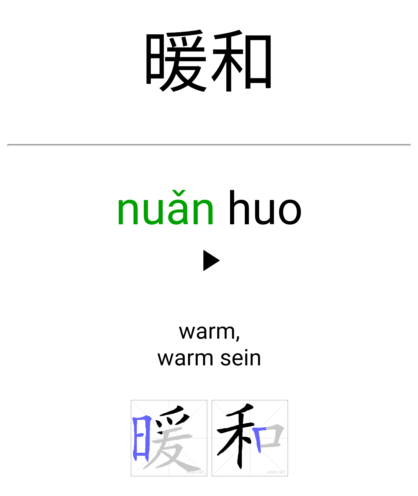
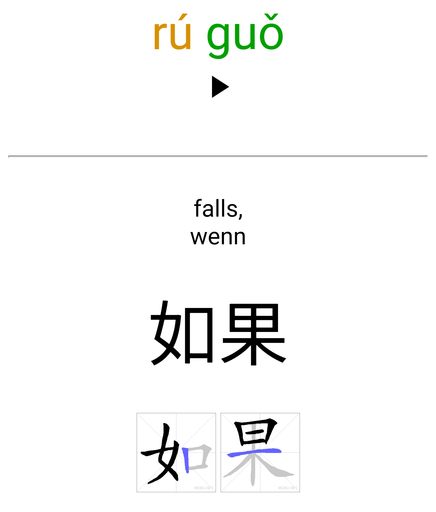

# Anki-ChinaEntdecken
Anki Deck für das Lehrbuch: China Endecken

Derzeit gibt es Karteikarten für Buch 2, Kapitel 1-9

<br>
<br>

<div align="center">
    
    
    
</div>

<br>

## Lernen

* Installiere [Anki](https://apps.ankiweb.net/)
* Füge die Erweiterung [CrowdAnki](https://ankiweb.net/shared/info/1788670778) hinzu (Anki->Extras->Erweiterungen)
* Füge dieses Deck hinzu (Anki->Datei->CrowdAnki import from disk/github)

#### Praktische Einstellungen
* Neue Karten zufällig (Stapel->China Entdecken Optionen->Neue Karten->Reihenfolge)
* Zeit für nächste Wiederholung ausblenden (Anki->Extras->Einstellungen->Einfach)
* Zähler für verbleibende Karten ausblenden (Anki->Extras->Einstellungen->Einfach)
* Nur eine Richtung lernen (Anki->Extras->Auswahlstapel erstellen->Suche "card:Simplified")
* Ein Kapitel und eine Richtung (Anki->Extras->Auswahlstapel erstellen->Suche "card:Simplified tag:Buch_2::Kapitel_5")

<br>

## Erweiterung des Decks

Eine Anleitung wie das Deck um neue Vokabeln erweitert werden kann findet sich in [muster.txt](muster.txt).

Dabei können Vorlagen aus folgenden schon vorhandenen Decks verwendet werden:
* [Official Domino Chinese Level 1-20 Complete Vocabulary](https://ankiweb.net/shared/info/722819818)
* [Most Common 3000 Chinese Hanzi Characters](https://ankiweb.net/shared/info/39888802) \
  Tabelle: [Most Common 3000 Chinese - ANKI with Traditional.csv](https://docs.google.com/spreadsheets/d/1j5-67vdCUeAuIzmikeCgNmXaFZTuXtT4vesjnrqSOjI/edit?usp=sharing)

Diese müssen dazu in der Anki-PC Anwendung installiert und anschließend mit CrowdAnki exportiert werden.

Grundsätzlich kann jeder Texteditor verwendet werden um die [Anki-ChinaEntdecken](Anki-ChinaEntdecken.json)-Datei zu erweitern, es empfielt sich jedoch einen mit Syntaxempfehlungen auszuwählen, zum Beispiel [VS Code](https://code.visualstudio.com/).

<br>

### Automatische Ergänzung (Anleitung für Entwickler)

Einige Felder wie die Karteikartenid, Strichreihenfolge oder das Audiobeispiel werden automatisch, zum Teil aus den oben gelisteten Decks generiert.

Installiere dazu die benötigten Bibliotheken:
```bash
pip3 install --upgrade -r requirements.txt
```

Die dazu nötige Ordnerstruktur sieht wie folgt aus:
```bash
AnkiDecks
    Anki-ChinaEntdecken                                     <- Dieses Repository
        media
        add_additional_tags.py
        Anki-ChinaEntdecken.json
        ...
    Chinese__Most_Common_3000_Hanzi                         <- Mit CrowdAnki exportiert
    Domino_Chinese_Level_1-20_Complete_Vocabulary           <- Mit CrowdAnki exportiert
    Most Common 3000 Chinese - ANKI with Traditional.csv    
```

Für die Generierung der Audiodateien wird zusätzlich noch ein kostenfreier Api-Schlüssel für den [Google Text-to-Speech Dienst](https://cloud.google.com/text-to-speech/) benötigt. Außerdem muss der Schlüssel in dem Terminal exportiert werden, siehe dazu [create_voice_data.py](create_voice_data.py).

Nun kann der Datensatz automatisch ergänzt werden:
```bash
python3 add_additional_tags.py
```
